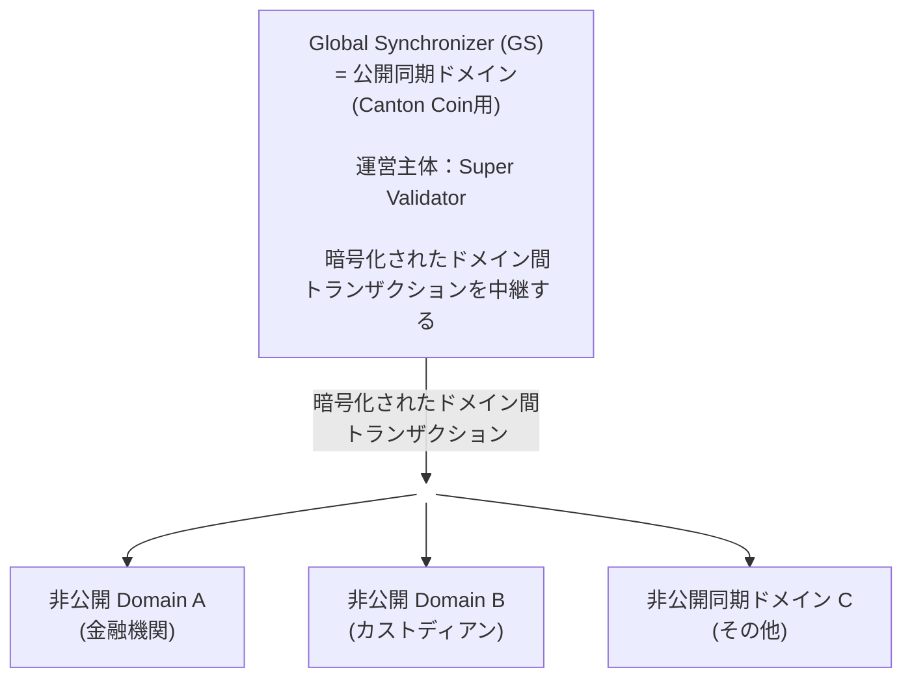
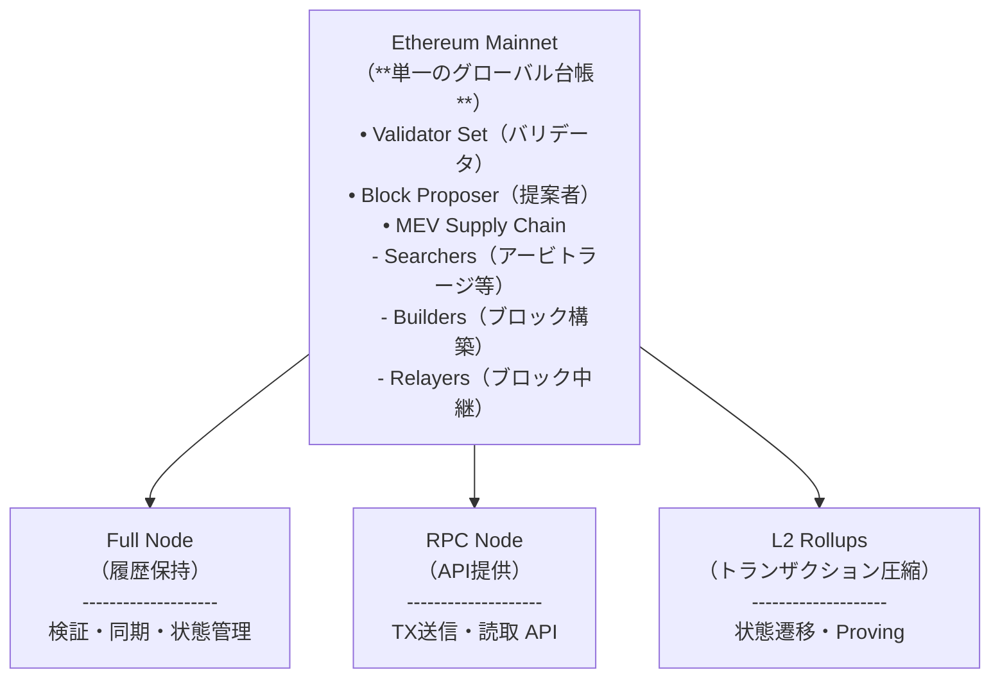
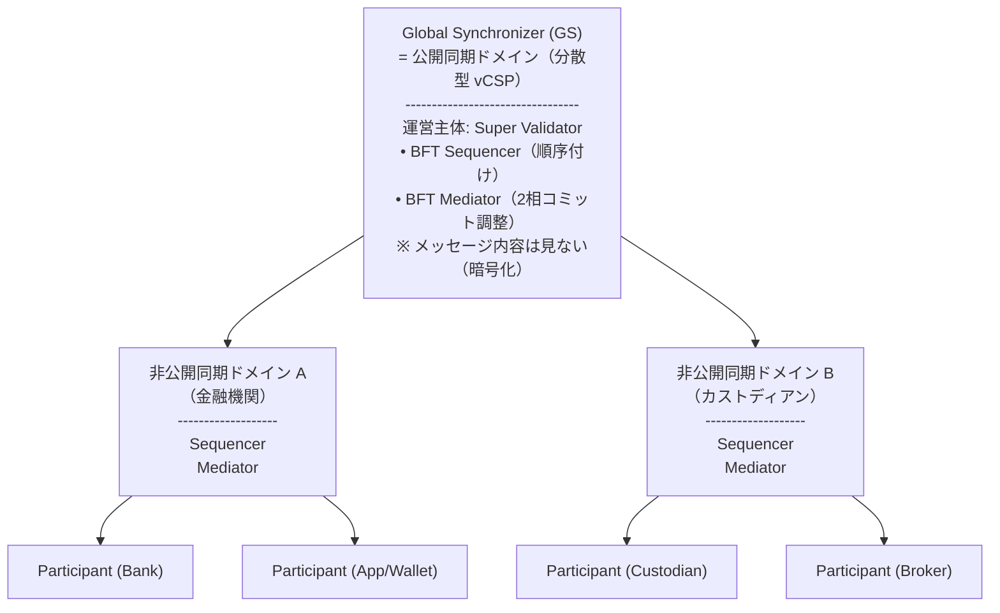
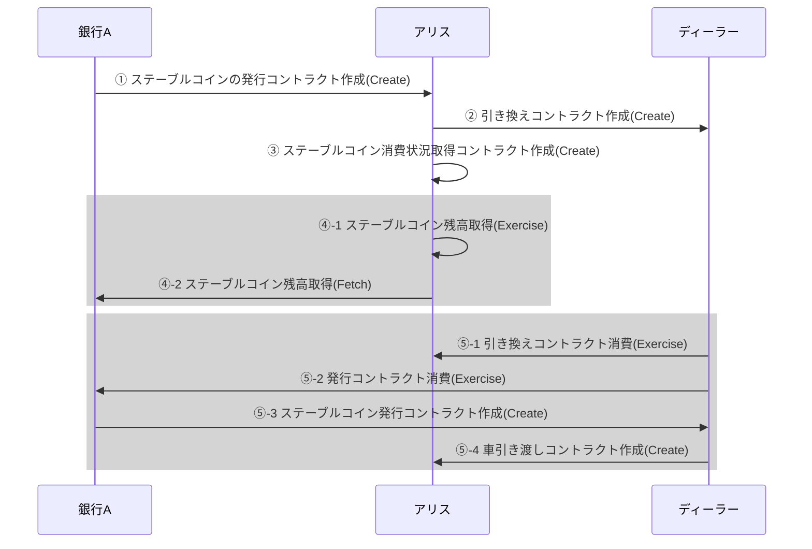
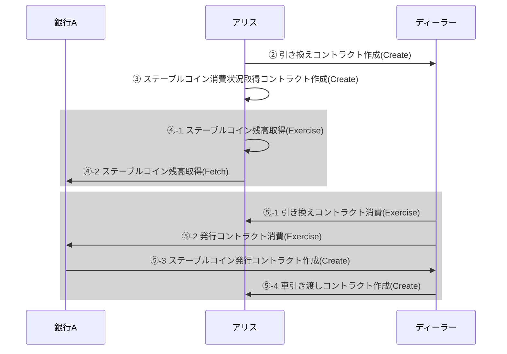
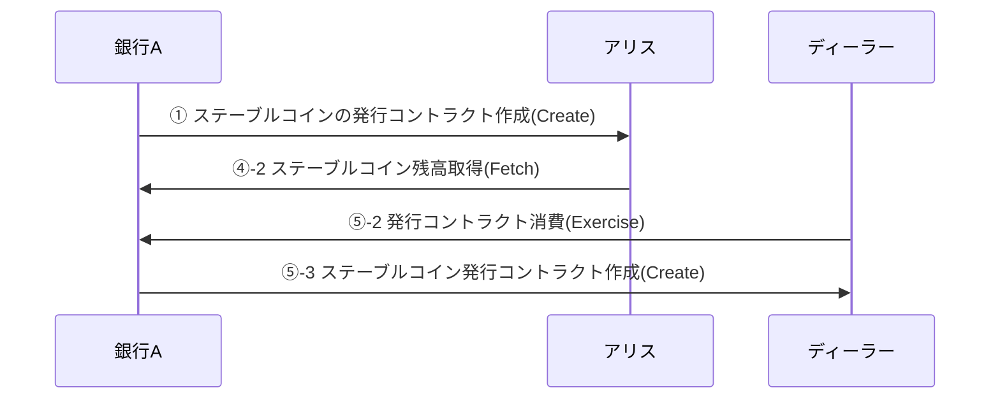

## 本記事の概要

本記事の前半では、ブロックチェーンに関わる非技術者の方々に、「金融機関向けネットワーク」というお触れで作られた Canton Network にはどういった価値があるのか、「金融機関向けネットワーク」はどうあるべきかを念頭に置いて説明します。
その後、パイを取り合う競争相手や競合との違いを説明します。
後半においては、ブロックチェーンのノードを立てているなど技術的な知見をお持ちの方に向け、Canton Network のアーキテクチャなど技術的な強みを解説します。

## 「金融機関向けネットワーク」とは何か

本稿において *「金融機関向けネットワーク」* という単語の意味は、銀行・証券会社等の規制の対象となる団体が各種法令・ガイドライン・各団体内の規則やそこから導出されるシステムの機能・非機能要件を満たしつつ、資産や決済のプログラマブルな取引を安全に行うことができるネットワークを指します。特に、国際標準（PFMI）で求められるガバナンス・リスク管理・最終性・オペレーショナルレジリエンス等を満たすものです。

昨今においては、JPYC 株式会社が資金決済法第 37 条に基づく資金移動業者として登録され、日本円建てステーブルコインを発行できるようになりました。企業もしくは金融機関がブロックチェーンを利用するうえでの法規制に関連する課題としては、例えば発行したトークンが資金決済法上に既定される暗号資産となるのか、金商法上で規定される有価証券に該当するかが挙げられます。また、行う事業の形態により、暗号資産交換業者のライセンス取得が必要なことに加え、トラベルルールへの対応等も必要となります。

本章では、まず金融機関がブロックチェーンのような分散型台帳技術を自身のビジネスに利用したいと考えるときに、どういった要件を求めているか、*簡易に*議論します。

金融機関では、以下に示す要件を利用するシステムに求めます。そういったものは、PFMI（金融市場インフラの国際基準）や金融庁のガイドラインにより要請されるものです。

1. 選択的な匿名性
PFMI において、機密情報の厳重な保護及び当事者間での情報提供を両立させることが求められています。これに従えば、下が要件として求められます。

- 取引データは原則として、関係当事者間でのみ共有されること
- 監査・検証時のみ、開示できること
通常のパブリックブロックチェーンにおいては、トランザクションは公開されてしまうため、適合性は低くなります。

1. 監査適合性・証跡の完全性
金融庁のガイドラインによれば、事後に検証が可能なこと、取引実行の再構成・再検証の可能なことが求められます。これに従えば、下が要件として求められます。

- 改ざんが不可能なこと
- 取引（スマートコントラクトであれば、スマートコントラクトの実行ログ等）のトレース情報が取得できること
この点に関しては、通常のパブリックブロックチェーンでは、適切な履歴を保有するノードにおいて、適合します。

1. 高可用性
PFMI において、24 時間 365 日の連続運用、障害時の高速復旧が求められています。これに従えば、下が要件として求められます。

- BFT 耐性があること
- 可用性が十分に高いこと
十分に成熟したもしくはノード数が多いチェーンでは、適合していることがほとんどです。

1. ガバナンス・責任分離
PFMI/金融庁のガイドラインから、下が求められています。

- 運営主体が明確であり、システムの責任分界点が明確であること
通常のパブリックブロックチェーンにおいては、金銭的なインセンティブにおいてのみ結び付けられていることが多く、また permissionless なチェーンにおいては、不特定多数がチェーン運営に参加することにもなり適合性が低くなります。

1. ファイナリティ
PFMI においては、"final settlement is final" 決済確定後に巻き戻ることがないよう求められており、確率的ファイナリティでは認められない場合が生じます。多くのチェーンにおいては解決しつつあります。

こういった形で、複数の制約により、一概にパブリックブロックチェーンで金融市場インフラを構築できるとは言えません。金融インフラ水準としては、制御可能なプライバシー機能、ファイナリティ、ガバナンスや責任分離が求められます。

次章では、Canton Network の概要を説明し、本章で議論してきた金融機関の求める要件を満たすことを見ていきましょう。

## Canton Networkの概要

本章では、前章で議論した金融機関特有の要件に対して、どのように、「金融機関向けネットワーク」として Canton Network がその課題を解決しているか紹介します。議論の前提は、 *Canton Network はブロックチェーンではない、分散型台帳技術の 1 つ* ということです。

### Canton が目指すミッション・設計思想

Canton Network の目指すものは、従来の金融資産・取引市場を金融機関の求めるプライバシー要件に準拠して電子化できる環境です。例えば機関ごとに隔離されたデータ領域を構築できる機能と GDPR に準拠した最小限のデータの共有機能、金融取引を念頭に置いた隔離されたデータ領域間での相互連携を実現しています。そのため上で挙げた課題に対して、下のように対応しています。

なお、Canton Network は先ほども述べたようにブロックチェーンではなく分散型台帳技術として、従来のブロックチェーンでは当然な、「単一チェーン上で全データ(トランザクションの内容を含む)を共有する」方式ではありません。
**複数の隔離されたネットワーク Sync Domain** をもち、 Sync Domain を跨いだトランザクションの処理には、共通の通信レイヤーとして Global Synchronizer をもちます。
また、DVP 決済(Delivery Versus Payment：引き渡しと支払を連動させ、証券と資金授受のタイミングを揃える決済手法) が可能な、アプリが相互運用する **ネットワークオブネットワーク** つまり隔離されているネットワークの連合体として設計されています。

1. 選択的な匿名性
自身の関連するコントラクト・トランザクションのみ閲覧可能となり、ノード自体も、自身の検証に必須な部分のデータのみを保有・検証します。金融機関が求める、取引に関連する相手への情報の制限に対応し、開発者が情報共有の幅を選択可能になっています。もちろん、スマートコントラクトの実装により、公開できます。
1. 監査適合性・証跡の完全性
他のパブリックブロックチェーンと同様に、Canton Network においても自身の関連するコントラクト・トランザクションについては全ての処理ログが記録されますので、監査にも対応可能です。
1. 高可用性
完全にはパブリックではなく、バリデータ参加には運営主体もしくは他のサービスプロバイダーからの承認が必要です。複数のノード運営者がおり、12/1 現在では 13 の Super Validator (ブロック生成等を担当)、672 の Validator ( Super Validator の生成したブロックの検証)が Canton Network を運営しており、Sync Domain を跨いだ可用性は十分に確保されています。
なお、各 Sync Domain においては、それぞれ別の Super Validator/Validator の集合を持つため、 Sync Domain ごとの可用性は各 Domain に依存します。
1. ガバナンス・責任分離
Canton Network では、トランザクションデータは全て当事者間以外にとっては暗号化された状態で実行・検証が進行します。また、 Sync Domain を跨いだトランザクションについては Global Synchronizer を通過するものの、同じく暗号化された状態で処理されます。 Sync Domain 内で閉じるトランザクションについては、各 Sync Domain に責任が分離されていますし、 Domain を跨いだトランザクションについても、処理・検証のみのインフラが提供されるのみとなります。
上でも述べたように、 Sync Domain においては、それぞれネットワークごとにインフラを管理するため、権限は各ネットワークの管理可能な範囲に分離されています。
1. ファイナリティ
トランザクションは、トランザクションに関係するノードの承認がなされ、コミットされるまで確定しません。ノードの承認がなされれば、それぞれのノードの残高等は即座に書き変わり、後で書き変わることはありません。もし一人でもトランザクションに関係するノードがそのトランザクションを承認しない場合は、トランザクション自体がロールバックされ、なかったものとして扱われます。

なお、 Canton Coin が存在するのは、デフォルトで存在する公開された同期ドメイン、 Global Synchronizer の運用するネットワークです。下図は、Global Synchronizer と各 Sync Domain の関係及びドメインを跨ぐトランザクションの処理フローを示すものです。

<!-- textlint-disable -->

<!-- textlint-enable -->
なお、同一ドメイン内のトランザクションは各ドメイン内で完結します。

本章のまとめとして、金融機関の求める事項をどのように Canton Network が満たしているかを表で示します。

| 要件                     | 金融機関からの要求事項                                                                                                                           | Canton Network での適合性                                                                                                                           |
| -------------------- | ------------------------------------------------------------------------------------------------------------------------------ | ------------------------------------------------------------------------------------------------------------------------------ |
| 選択的な匿名性 | - 取引データは原則として、関係当事者間でのみ共有されること - 監査・検証時のみ、開示できること                                                                                     | 自身の関連するコントラクト・トランザクションのみ閲覧・検証可能                                                                                     |
| 監査適合性・証跡の完全性         | - 改ざんが不可能なこと - 取引のトレース情報が取得できること                                                               | 自身の関連するトランザクションの検証・処理のログから監査対応が可能                                                                                     |
| 高可用性                  | 可用性が十分に高いこと                                                                                                                         | ネットワークごとに可用性は異なるが、 ネットワークを跨ぐトランザクションの処理にかかる可用性は十分に高い                                                                                                        |
| ガバナンス・責任分離             | 運営主体が明確であり、システムの責任分界点が明確であること                                                                                                               | トランザクションは暗号化されているため、ネットワークごとにほぼ全ての権限が分離されており、ネットワークを跨ぐトランザクションについても、処理・検証のインフラのみが整備されている |
| ファイナリティ                | 決済確定後に巻き戻ることがないこと  | トランザクションに関係するノードの承認後、コミットされれば確定                                                                                                                |

次章からは、 Canton Network の競合としてどういったものがあるかを示し、それぞれどのような優位性があるかを説明します。

## Canton Networkの競合と優位性

本章では、以下のような金融機関による利用が行われているチェーンについて、 Canton Network とどう異なったアプローチで、要求仕様を満たしているのか紹介します。

- R3 Corda
- Avalanche L1s (旧 Avalanche Subnet)

1. R3 Corda
すでに稼働しており、金融機関向けの分散台帳としての実績を持っています。規制対応や業務フローに合うように開発されており、多くの銀行・インフラ事業者が参加したコンソーシアムでの利用が進められています。よく知られているように、日本では SBI ホールディングスが米国 R3 社との合弁企業として "SBI R3 Japan" を立ち上げ、2019 年という早い段階から実証実験・展開を進めています。

### R3 Cordaの仕様

クローズなネットワーク(BN と呼びます。Canton Network では Sync Domain に近しい単位です)を作成し、その中で検証ノードクラスター(Notary と呼びます)・他の実行ノード・アプリ用ノードなどを作成し、クローズなネットワーク内で処理が可能です。
BN ごとに異なるポリシー、異なるコントラクトの仕様を設定でき、各機関やグループごとに異なる要件を持つことができます。トランザクションは同一 BN 内で順序付け・完結するため、BN 外には原則トランザクションデータは送付されません。

### R3 Cordaの機能概要

1. 選択的な匿名性
Canton Network と同様に、自身の関連する取引の情報のみ閲覧可能となり、ノード自体も、自身の検証に必須な部分のデータのみを保有・検証します。
1. 監査適合性・証跡の完全性
Canton Network と同様に、ネットワーク全体で統一された取引の順序付けはされませんが、関連する当事者のログを確認することで順序を検証できます。そのため、Corda R3 においても監査に対応可能です。
1. 高可用性
検証ノードクラスターを BN 作成時に指定する必要があります。このクラスターは BN のポリシーに依存して決められ、単一の団体が運営することも複数の団体が運営することもあり、 BN ごとに可用性は異なります。
1. ガバナンス・責任分離
Corda では、Canton Network のような BN 間の通信レイヤーとしては存在しません。そのため、純粋に各 BN 内に責任・ガバナンスは分離されます。

一番大きな Canton Network との違いは、全ての BN が独立したチェーンといえるので、BN 間の相互作用は非常に限定的でブリッジのようなアプリを作る必要があるということが挙げられます。

1. Avalanche L1s
Avalanche は、X-Chain/P-Chain/C-Chain の異なる特性を持つチェーンからできるマルチチェーン構造を採用した、ブロックチェーンです。従来サブネットと呼ばれていたカスタム L1 機能を持っており、独自のガバナンス・エコノミクス、コンプライアンスを設定できる独立したチェーンを簡単に設定できます。2025 年 4 月から、三井住友フィナンシャルグループは Ava Labs と協業し、ステーブルコインの事業化を視野に入れた共同検討を行っています。

### Avalanche L1sの仕様

L1s 開発者は、バリデータのクラスター・トランザクションを実行する実行マシン、トークンエコノミクス・ガバナンス・コンプライアンスを全てカスタムできます。
しかし、L1s を作成するためには、Avalanche P-Chain において手数料の支払・登録するバリデータ情報の登録・IP 情報の登録をする必要があります。
これにより、P-Chain に密に情報連携した状態で新しい L1 を作成できつつ不正行為（特にバリデータ自体の登録・削除）は Avalanche P-Chain に記録され、L1 側で攻撃してもその記録を消すことはできなくなります。

### Avalanche L1sの機能概要

1. 選択的な匿名性
Avalanche L1s においては、開発者がカスタム可能なため、コンプライアンス要件に従い、必要に応じて Canton Network や Corda と同様の許可制機能を自身で実装・設定できます。
1. 監査適合性・証跡の完全性
上と同じく、開発者がカスタム可能です。なお、Avalanche P-Chain/C-Chain では、通常のブロックチェーンと同様に厳密なトランザクションの順序付けがなされているため、同様の仕組みを採用することで監査適合性を持つことができます。
1. 高可用性
Canton Network や Corda と同じく、独自のバリデータクラスターを持ちます。
1. ガバナンス・責任分離
Corda とほぼ同様に、各 L1 のバリデータクラスターのみにガバナンスが依存します。なお上でも述べたように、P-Chain はあくまで L1 のバリデータ情報や IP 情報の保存及び Stake されている AVAX 等の緊急対応機能があるのみで、ガバナンスに影響は及ぼしません。

Canton Network との違いは、カスタム性が非常に高い分、実装コストの高い可能性があること、全ての L1s は独立したチェーンなことから、相互作用にはブリッジのようなアプリが同様に必要なことです。

## Canton Networkのユースケース

Canton Network が実際に利用されている・利用されようとしているユースケースについて紹介し、概要についてまとめます。

- トークン化債券・証券
- 担保付き取引、証券等の清算・決済
- カストディ

### トークン化債券・証券

トークン化資産の発行と管理：債券、国債、保険商品等などの**実世界資産 (RWA)**をオンチェーンで表現し、そのライフサイクル全体（発行から償還まで）を管理します。現在のバーゼル規制によれば、パブリックブロックチェーン上での無担保資産には 1250%のリスクウェイトが適用されます。Canton Network は、分離された Sync Domain を持つ、現行の規制準拠の構造を提供することで、将来的にこの規制を回避することを目指しています。

### 担保付き取引、証券等の清算・決済

デリバティブ取引等での証拠金として、トークン化された資産・債権等を用い、清算を自動化します。Canton Network においては、複数の Sync Domain での DVP 決済が可能なため、複数の金融機関がそれぞれ管理する資産の清算・取引が可能となります。また、トランザクションは一体として処理されるため、即時決済にも利活用できます。

### カストディ

Taurus のような主要なカストディアンがすでに Canton Network に参加しており、規制環境下での資産管理を進めています。

最後にここまでの内容をまとめ、概要編を終了します。

## Canton Networkについてのまとめ（中間）

ここまで、 Canton Network が金融機関の求める要求事項を満たし、分離されたネットワークを持つ分散型台帳となっていることを示しました。また R3 Corda に非常に似通った仕様を持っているものの、相互運用性を重要視し、かかわるユースケースに力を注いでいます。

後半では、Canton Network のアーキテクチャや技術的な強みを紹介し、より技術者向けに Canton Network を紹介します。

## Canton Networkのアーキテクチャ

Canton Network を Ethereum と比較すると、次のような差異があります。

### Ethereum：単一台帳モデル

#### Ethereumの特徴

- 全ノードは全ブロックデータ（トランザクションを含む）を実行・検証し、同一のブロックチェーンの状態を保持する
- 上のトランザクションの実行に際し、トランザクションの中身も全ノードに公開される
- スマートコントラクトは単一種類の VM である EVM 上で実行される
- プライバシーは実装されておらず、Layer2 もしくは ZKP の利用が必須となる

#### Ethereumのステークホルダー・ノード

- Validator（バリデータ）
  - Beacon Chain で登録された ETH ステーカー
  - 提案ブロックの検証、アテステーション（投票）を担当

- Block Proposer（ブロック提案者）
  - エポックごとにバリデータの中から選ばれる
  - Relayer 経由で Builder が構築したブロックを提案

- MEV ステークホルダー
  - Searcher：サンドイッチ・アービトラージ・清算などの状況を確認し、もっとも利益の出る TX バンドルを収集
  - Builder：取引の順序を最適化し MEV 収益が最大化されるブロックを構築
  - Relayer：Builder → Proposer 間の中継、検閲耐性と秘密保持を提供

### Canton Network：複数同期 Domain + Global Synchronizer（非ブロック構造）

<!-- textlint-disable -->
<!-- markdownlint-disable -->

<!-- textlint-enable -->
<!-- markdownlint-enable -->

#### Canton Networkの特徴

- ブロックチェーンとは異なり、全ノードが同期するブロックは存在しない
- 各同期ドメインに独立した Sequencer, Mediator が存在し、同期ドメイン内でのトランザクションの順序付け、関係者の合意調整を行う
- クロスドメインのトランザクションのみ、Global Synchronizer を経由して処理される
- トランザクションデータは原則として暗号化されており、トランザクションの関係者しか復号化できない
- $CC については、公開同期ドメインでトランザクションが処理されるため、公開される

#### Canton Networkのステークホルダー・ノード

- Sequencer
  - ドメイン内のトランザクションを順序付け
  - ドメイン内のトランザクションの整合性を検証
- Mediator
  - ドメイン内のトランザクションにおいて、関係者の合意(2 相コミットと呼ぶ)を調整
- Super Validator
  - Global Synchronizer（公開同期ドメイン）内での、Sequencer/Mediator を実施
    - BFT コンセンサスを用いて SV 間のコンセンサス
  - ドメインを跨ぐトランザクションにおいて、Sequencer/Mediator を実施
  - Global Synchronizer のガバナンスへの参加
  - Canton Name Service など、デフォルトのアプリ提供
  - Canton Coin の価格オラクル提供

## Canton Networkの優位性

R3 Corda をベースとして、データ領域ごとの相互作用が難しかった点を拡張させた分散型台帳技術というのがもっともわかりやすい考え方です。相互運用性を初期実装するために、 DAML というデータモデルを標準とし、同期ドメイン間の相互作用ができるようになりました（スマートコントラクトの実行環境・データ体系が揃うため）。Corda では、開発者のカスタマイズ性を上げるために、データモデルも含め、同期ドメインごとに選択可能としたため、互いの同期が難しかったという点がありました。

通常のチェーンとどう違うか、について、特に次の項目に絞り説明します。

- 非ブロックチェーンの分散型台帳技術
- データモデル・DAML
- コンセンサスモデル

### 非ブロックチェーンの分散型台帳技術

Canton Network は、 Ethereum のような、取引が一定間隔でブロックに取り込まれ、ブロックをすべて検証することで、全ノードが同一の状態に同期する仕組み（いわゆるブロックチェーン）ではありません。自身にとって関係のある取引のみを保存し、ネットワーク全体では全データが存在するような台帳を作ることを目的としています。

上の画像では、Alice, Bob, Charlie がそれぞれ自身に関係する取引のデータのみを持っている様子を示しています。 Canton Network では、そもそも自身に関連しないデータを保有する必要はない、という観念でネットワークを設計しています。そのため、原則としてトランザクションの関係者のうちの 1 パーティは誠実に活動しなければ、不正なトランザクションが処理されることになります。

なお、Canton Network では、公開同期ドメイン（$CC が存在するドメイン）・非公開同期ドメインが存在します。 $CC の存在する公開同期ドメインにおいては、トランザクションの中身は公開されていることから、 Super Validator が不正なトランザクションを除外できます。非公開同期ドメインにおいては、挙げたように不正なトランザクションが存在しえますが、後述するデータモデルの適切な設計により、防止できます。

### データモデル・DAML

Canton Network では、データモデルとして DAML（Domain Application Modeling Language）を採用しています。
EVM とのもっとも大きな違いは、① DAML では原則データは暗号化されること ② DAML では、UTXO に近しい仕組みが採用されることです。

①については、 Sequencer はトランザクションの中身は検証せず、署名の検証・トランザクションのタイムスタンプの採番のみを行います。トランザクションは関係者が全員復号化し、内容を検証したのちに署名し、 Mediator に送信します。

②については、通常 EVM ではアカウントベースモデル、アカウントに対してのトランザクションの結果としての残高を主に管理します。
そのため、EVM ではブロックごとに適用後のチェーン状態（アカウントの残高・nonce など）の Hash が含まれ、チェーン状態をノード間で同期しています。
一方、 Canton Network では、 Bitcoin で採用されている UTXO モデルに近しい、 Extended UTXO モデルを採用しています。
UTXO モデルでは、送金時には Unused Transaction Output（UTXO）を消費し、基本的にトランザクションを送信される相手がそのトランザクションで生まれた新しい UTXO の保有者となり、その UTXO を消費する権利を得ます。

Extended UTXO モデルでは、トランザクションをより細かい単位の"アクション"に分け、UTXO として従来与えられていたものは、Unused Contract になります。EVM においては、Event log として確認できますが、 Canton Network においては、可視性の変動がアクションごとに発生することが理由です。また、アクションは以下のように定義されます。
アクションは以下のいずれかを指す。

- Contract を作成する *Create* アクション
- Contract で定められる権利を行使する *Exercise* アクション
  - Exercise には、Contract を消費する消費型と非消費型(一度しか行使できない権利、何度か行使できる権利に対応)がある
- Contract の消費状況を確認する *Fetch* アクション
- Contract に ID を付与する *Assertion* アクション

具体例として、ステーブルコインを用いて車を購入するケースを考えましょう。この時生まれるトランザクションは *「アリスが保有する銀行Aの発行するステーブルコインを、ディーラーに送金し、車と交換する」* となります。細かいアクションで表記すると、次のようになります。

1. アリスが保有するステーブルコインを消費する(Exercise)
1. 銀行 A はディーラーにステーブルコインを発行する(Create)
1. 銀行 A はアリスに残額分のステーブルコインを発行する(Create) ※おつりがある場合
1. ディーラーはアリスに車を引き渡すコントラクトを発行する(Create)

次に、このデータモデルを採用することにより必須となるコンセンサスモデルについて説明します。

### コンセンサスモデル

Canton Network においては、 *Proof of Stakeholder* というコンセンサスモデルを採用しています。 上でも説明したように、 Canton Network では、関係者にしかトランザクション情報は公開されず、関係者のトランザクションへの合意をもってファイナリティが成立します。

先ほどの車の引き渡しをより細かく見るために、Fetch を用いた検証を含めた流れを説明します。

以下の説明では、DAML の原則として**コントラクトは消費(Exercise)の前に作成(Create)される必要がある**ことを前提とします。

#### 合成台帳の視点

全体の流れを理解できるように、実際には各当事者ごとに分割されるアクションを、全て時系列ごとにまとめて記載します。上から下に時系列が進行していますが、Exercise ではないアクションについては、クリティカルパスに関係しない場合、順序が入れ替わる可能性に留意してください。また、同じ色で囲っている領域については、Exercise アクションに従属するサブアクションを示しています。

①銀行 A は、アリスにステーブルコインを発行する(Create)

②アリスは、ディーラーに車と引き換えにステーブルコインを送金するコントラクトを作成する(Create)

③アリスは、銀行 A の発行しているステーブルコインの自身に紐づくコントラクトの消費状況を取得するコントラクトを作成する(Create)

④-1 アリスは、ステーブルコインの情報を取得するコントラクトを消費する(Exercise)

④-2 アリスは、銀行 A の発行しているステーブルコインの自身の残高を取得する(Fetch)

⑤-1 ディーラーは、アリスの作成した引き換えコントラクトを消費する(Exercise)

⑤-2 ディーラーは、アリスに銀行 A がステーブルコインを発行するコントラクトを消費する(Exercise)

⑤-3 銀行 A は、ディーラーにステーブルコインを発行する(Create)

⑤-4 ディーラーは、アリスへの車引き渡しコントラクトを発行する(Create)

### ディーラー台帳の視点

ディーラーに関連する台帳は以下のみとなります。

### アリス台帳の視点

アリスに関連する台帳は以下のみとなります。

### 銀行A台帳の視点

銀行 A に関連する台帳は以下のみとなります。

最終的に、こういった形で自身に関連するアクションのみ、署名者として参加することになります。アリス・ディーラーはステーブルコインを何らかの形で詐取できるような不正にはインセンティブがあります。ステーブルコインを発行する銀行 A は、不正行為が起きれば自身のステーブルコインの信用が失墜するので、誠実に行動するインセンティブがあるため、結果として重要なトランザクションについては、不正が起きることはありません。

こういった形で、 Canton Network では金融機関のような機関の仲介をほぼ必須とすることで、トランザクションを誠実に処理させることとしています。この仕組みをもって、 *Proof of Stakeholder* と呼んでいます。トランザクション情報が最小限でしか公開されない点についても、上の台帳構造から、確認いただけます。

## まとめ

前半では、 Canton Network について非技術者向けに概要と競合チェーン・技術を紹介しました。後半では、 Ethereum とのアカウントモデルの違い及びデータモデルについても紹介しました。非公開な同期ドメインに限られますが、非公開な同期ドメインは部分的に中央集権的な設計になることが予想されるため、主な主体となる機関が適切に管理することを前提に、上のコンセンサスモデルを置いています。主な利用機関は金融機関やステーブルコインを発行する機関、中央集権的にブロックチェーン技術・分散台帳技術を使いたい方々だと考えられますので、参考としていただければ幸いです。

参考資料はこちらです。

- [Principles for Financial Market Infrastructures (PFMI)](https://www.bis.org/cpmi/info_pfmi.htm)
- [金融市場インフラのための原則](https://www.fsa.go.jp/inter/ios/20120416-1/07-2.pdf)
- [DAML Documentation](https://docs.daml.com)
- [Canton Documentation](https://docs.digitalasset.com/index.html)
